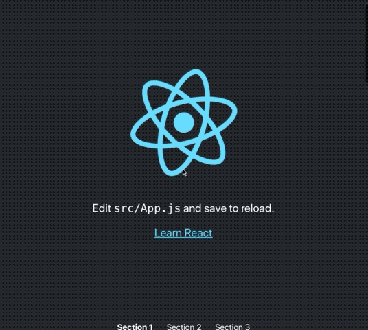

# react-use-scrollspy

[](https://travis-ci.org/Purii/react-use-scrollspy)
[](https://www.npmjs.com/package/react-use-scrollspy)
[](https://www.npmjs.com/package/react-use-scrollspy)
[](https://raw.githubusercontent.com/Purii/react-use-scrollspy/master/LICENSE)
[](https://www.patreon.com/purii)



## Installation

`react-use-scrollspy` is a React `Hook` which requires React **16.8.0 or later.**

```sh
// yarn
yarn add react-use-scrollspy
// or npm
npm i react-use-scrollspy --S
```

## Usage

```javascript
import useScrollSpy from 'react-use-scrollspy';
...
const activeSection = useScrollSpy({
  sectionElementRefs: [], // Array of References to DOM elements
});
```

| Parameter          | Default |  Type   | Description                                      |
| :----------------- | :-----: | :-----: | ------------------------------------------------ |
| defaultValue       |   `0`   |  `int`  | Default value that is returned (optional)        |
| offsetPx           |   `0`   |  `int`  | Set offset (optional)                            |
| sectionElementRefs |  `[]`   | `[Ref]` | Array of Refs to observe (e.g. via React `refs`) |

### with Refs

Use React `refs` for section elements like in the [provided example](/example).

```javascript
import React, { useRef } from 'react';
import useScrollSpy from 'react-use-scrollspy';

const App = () => {

  const sectionRefs = [
    useRef(null),
    useRef(null),
    useRef(null),
  ];

  const activeSection = useScrollSpy({
    sectionElementRefs: sectionRefs,
    offsetPx: -80,
  });

  return (
    <nav className="App-navigation">
      <span className={activeSection === 0 ? "App-navigation-item App-navigation-item--active" : "App-navigation-item"}>Section 1</span>
      <span className={activeSection === 1 ? "App-navigation-item App-navigation-item--active" : "App-navigation-item"}>Section 2</span>
      <span className={activeSection === 2 ? "App-navigation-item App-navigation-item--active" : "App-navigation-item"}>Section 3</span>
    </nav>

    <section className="App-section" ref={sectionRefs[0]}>
      <h1>Section 1</h1>
    </section>
    <section className="App-section" ref={sectionRefs[1]}>
      <h1>Section 2</h1>
    </section>
    <section className="App-section" ref={sectionRefs[2]}>
      <h1>Section 3</h1>
    </section>
  )
```
